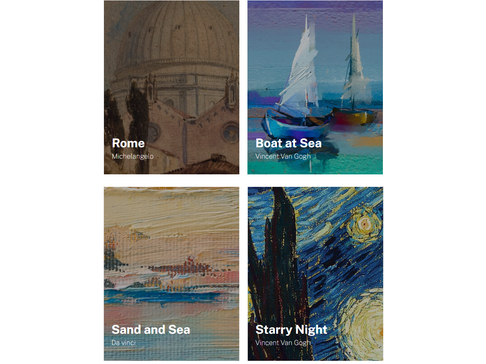

# Lista de imagens

Esse foi uma exercício realizado no módulo "Exercícios CSS Avançado - Flexbox" do curso Dev Quest - Dev em Dobro 

#### Dificuldades e aprendizados

Eu fiz esse exercício pela primeira vez utilizando o translate com propriedades negativas para posicionar a legenda das imagens, depois refiz o exercício utilizando o position absolute e relative assim como na resolução.

#### Design Desktop

#### Design Mobile
[]